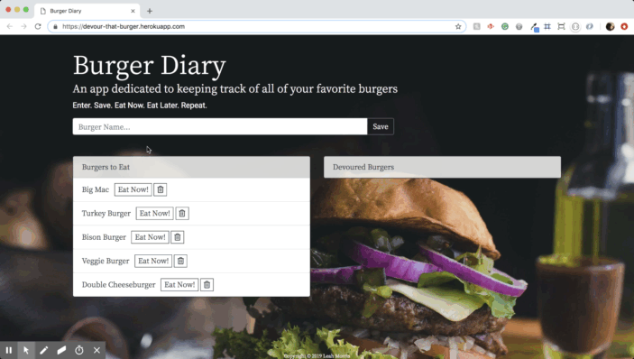
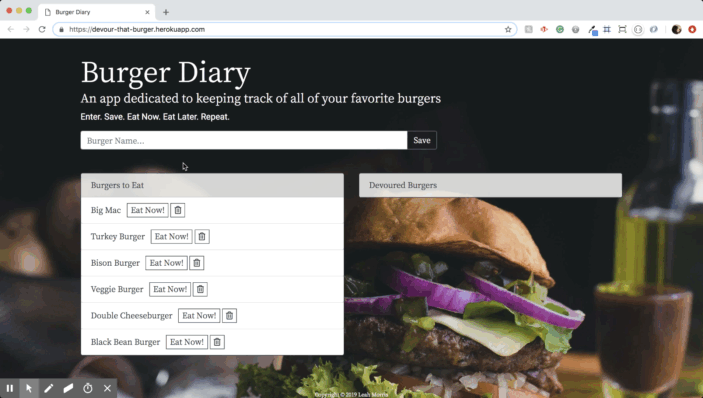
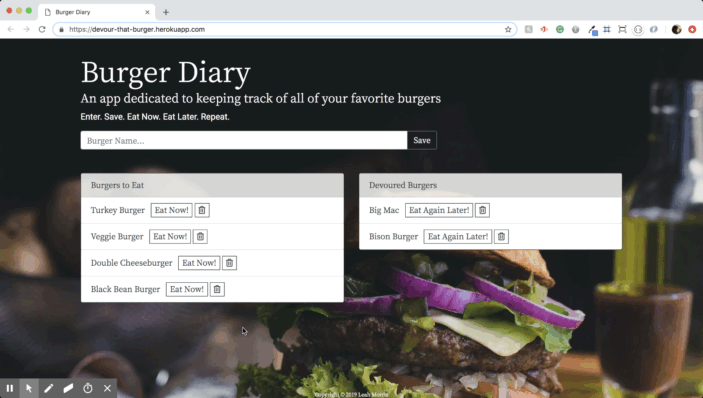

# Burger-App
Burger Diary is a web-based application that lets users input/add the names of burgers they'd like to eat and then logs the burgers, allowing them to be devoured whenever the user wants!

## Deployment
This app is deployed using Heroku.  Click <a href="https://devour-that-burger.herokuapp.com/">here</a> to start interacting.

## Interactions
Insert a New Burger

Update Devoured Status of Burger

Delete a Burger

## Tools/Technologies Used
<a href="https://www.npmjs.com/package/mysql">MySQL</a> 
<a href="https://getbootstrap.com/">Bootstrap</a> 
<a href="https://fontawesome.com/">Font Awesome</a> 
<a href="https://fonts.google.com/">Google Fonts</a> 
<a href="https://jquery.com/">jQuery</a> 
<a href="https://nodejs.org/en/">Node.js</a> 
<a href="https://www.npmjs.com/package/express">Express.js</a> 
<a href="https://handlebarsjs.com/">Handlebars</a> 
<a href="https://nodejs.org/en/">Express-Handlebars</a> 

